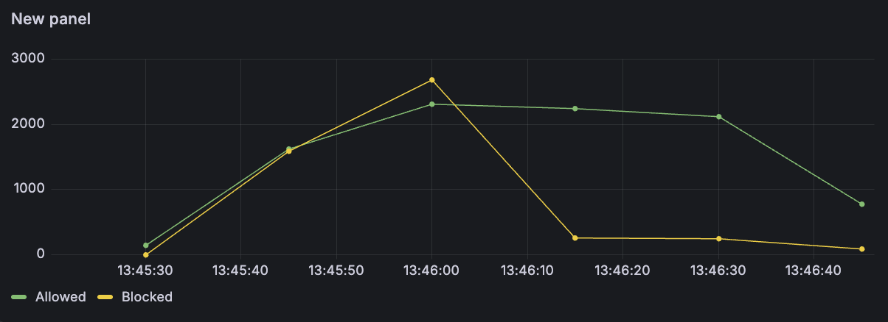

# Distributed Rate Limiter

Distributed rate limiter (Java 21, Spring Boot 3, Redis) ensuring that traffic quotas are enforced.

## Architecture

The system utilizes a Sliding Window Log algorithm. The core functionality is executed via an atomic Redis Lua script (`sliding_window_rate_limit.lua`). 

### Distributed Synchronization
When N server instances evaluate requests simultaneously, the Lua scripts are queued and executed atomically in Redis, preventing multiple requests from bypassing the limit if they arrive at the exact same time. Concurrency correctness is verified via `ExecutorService` thread-contention tests in `RateLimiterServiceIntegrationTest.java`.

### Fault Tolerance
A fail-open policy is implemented within the `RateLimiterInterceptor`. If the Redis datastore becomes unavailable or response times exceed the strictly configured 200ms timeout (`spring.data.redis.timeout`), the interceptor gracefully allows traffic to proceed. This prevents the rate limiting infrastructure from becoming a Single Point of Failure (SPOF) for the upstream APIs.

### Observability
Micrometer is integrated to track metrics independently of the application layer logs. Prometheus scrapes these metrics, enabling Grafana dashboards to visualize:
- `rate_limit_allowed_total`
- `rate_limit_blocked_total`
- `rate_limit_redis_errors_total`
- `rate_limit_redis_latency_seconds_max` (measuring latency impact of Redis calls on the HTTP request lifecycle)

Access Grafana at `http://localhost:3000` (admin/admin) to view the pre-configured "Distributed Rate Limiter Dashboard".

## Testing and Benchmarking

Integration tests with Testcontainers for a real Redis 7 instance.

### Load Test Results
A `k6` load test benchmark is included. Running on a standard local environment (Apple Silicon M4, 16GB RAM), it establishes a throughput of ~212,000 Requests Per Minute (RPM) and simulates a 2.5x distributed traffic burst. 

*   **Baseline Throughput**: ~150k RPM (2,500 RPS)
*   **Burst Throughput**: ~375k RPM (6,250 RPS)
*   **P99 HTTP Request Duration**: < 7ms
*   **Redis Lua Execution Overhead**: < 2ms
*   **Reliability**: 100% block rate on exhausted quotas with 0 unauthorized bypasses.

#### Precise Load Test Run Data (1-Minute Runtime)
- **Total Requests**: 212,212
- **Average Request Rate**: 3,537 req/s (212,197 req/min)
- **HTTP Request Duration**:
  - Average: 1.62ms
  - P90: 2.46ms
  - P95: 3.15ms
  - P99: 6.94ms
- **Checks Passed**: 100% (all responses 200 or 429)
- **Failed Requests (429s)**: 35.02% (74,320 out of 212,212)
- **Dropped Iterations**: 291 (negligible)
- **Network**: 37 MB received, 29 MB sent



## Setup Instructions

### Environment Provisioning
```bash
docker-compose up -d
```
This initializes Redis, Prometheus (port 9090), and Grafana (port 3000).

### Application Startup
```bash
mvn spring-boot:run
```
The demo endpoint is mapped to `http://localhost:8080/api/hello`.

### Executing Benchmarks
To reproduce the load test benchmark:
```bash
k6 run load-tests/load-test.js
```
